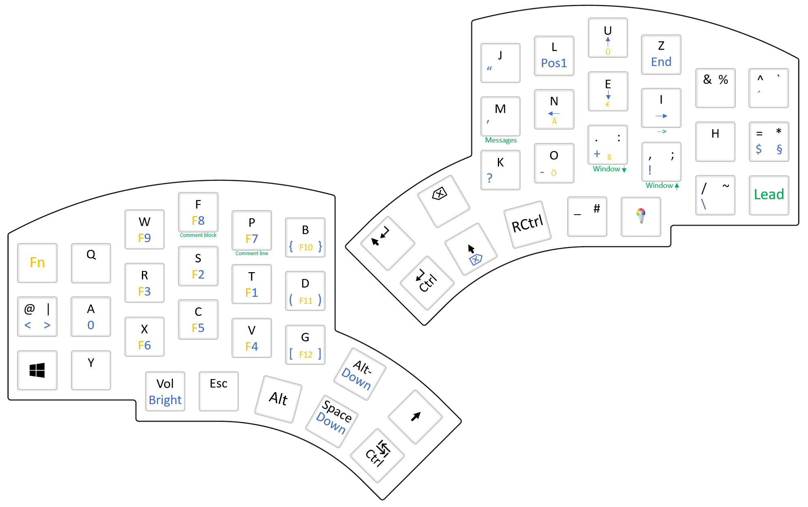

# Peter's Kyria Keyboard

## Concept

The basic concept of the design of this keymap is:

 - to put the most often used keys under the strongest fingers
 - to use only a few number of layers
 - to be as free as possible and not stick to any conventions

The layers of this keymap are the following:
1. Base layer (Colemak-PST which is Colemak-DH with some personal key-swaps)
2. "Down" layer which handles all number keys and the rest of the symbols
3. Function layer which takes care of F1 through F12
4. Lights layer handling the cool underglow LEDs

## Keymap in Detail

### Umlauts, ß, and €

Umlauts can be found by double-tapping the 'normal' keys <kbd>a</kbd>, <kbd>o</kbd>, and <kbd>u</kbd>, respectively. The € sign is under the <kbd>e</kbd>.  
The <kbd>ß</kbd> is created by double-tapping <kbd>v</kbd>. I decided not to put it under the <kbd>s</kbd> key in order to still be able to tap <kbd>ss</kbd> in a fast manner.

### Symbols

Most of the symbols are either directly reachable (like <kbd>@</kbd>, <kbd>&</kbd>, <kbd>/</kbd>, or <kbd>.</kbd> and <kbd>,</kbd>) or only need either <kbd>Shift</kbd> (like <kbd>|</kbd> or <kbd>~</kbd>) or <kbd>Down</kbd> (like <kbd>'</kbd>, <kbd>"</kbd>, or the opening brackets) in order to be reached. Only a few symbols are left that need both <kbd>Shift</kbd> and <kbd>Down</kbd> but these are almost only the closing brackets which in turn show some symmetry to the opening brackets.

There are no "dead" symbols anymore: <kbd>^</kbd>, <kbd>´</kbd>, and <kbd>`</kbd> are defined to be tapped twice if the user taps them once in order to directly show them. In turn, no "é" and other characters that rely on these symbols are possible to be typed anymore.

### Shift

The symbols that can be reached via <kbd>Shift</kbd> often do not follow any standard. Instead, the combination of "normal" typing and using <kbd>Shift</kbd> is based on what I find helpful.

Implementing this is quite a pain: You have to know and take into account the original combination of "normal" and "shifted" typing. If you e.g. want a key to be available directly when the key is pressed but originally this symbol is reachable via <kbd>Shift</kbd>, then you have to register (= press down) <kbd>Shift</kbd> first, register the "partner" key (= the key that is necessary to be pressed in order to get the actually wanted symbol to appear in combination with <kbd>Shift</kbd>), and then unregister (= release) <kbd>Shift</kbd> again. The same is true for symbols that are reachable via <kbd>AltGr</kbd>.  
This all lead to an implementation of various macros that handle the different cases of "normal", "shifted", and "altgr"ed typing.

### Digits and Function Keys

The digits 1, 2, 3, etc. go from right to left because that felt better for me.

The function keys are reachable via the same keys as the digits, e.g. <kbd>F1</kbd> is on the same key as <kbd>1</kbd>. Only the <kbd>Fn</kbd> key needs to be held or tapped before.

### Simplification of Some Key Combinations

Due to the fact that I use some key combinations very often, I paid special attention to their location:

- <kbd>Ctrl</kbd>-<kbd>x</kbd>, <kbd>Ctrl</kbd>-<kbd>c</kbd>, and <kbd>Ctrl</kbd>-<kbd>v</kbd> lie directly next to each other, and the <kbd>Ctrl</kbd> key is also on the left hand keymap in order to be able to access the key combination with only one hand.
- <kbd>Ctrl</kbd>-<kbd>Shift</kbd>-<kbd>something</kbd> is easily reachable by tapping the right <kbd>Ctrl</kbd> key twice.
- <kbd>Alt</kbd> and <kbd>Tab</kbd> are very close to each other in order to switch the application windows fast.
- <kbd>Right Ctrl</kbd> is available to get out of the Linux virtual machine easily.
- <kbd>Alt</kbd>-<kbd>some digit</kbd> to directly select a browser tab or a file in VSCode can be reached via double-tapping and holding the <kbd>Down</kbd> key and typing the respective digit key.
- etc.

### Volume and Brightness
The left rotary knob is defined to control the volume.  
Using it together with the <kbd>Down</kbd> key the brightness is controlled.

### Page Up/Down and Tab Hopping
The right encoder sends <kbd>PgUp</kbd> or <kbd>PgDn</kbd> on every turn.  
In combination with the <kbd>Down</kbd> key the encoder jumps to the next and the previous tab (e.g. in a browser, a terminal, or in VSCode).

### Predefined Messages

The leader key in the bottom right corner of the keyboard can be used for a lot of fancy key combinations. Currently, some short messages for the closing greeting at the end of emails are defined for <kbd>Lead</kbd>-<kbd>M</kbd>-<kbd>some digit</kbd> where <kbd>some digit</kbd> is of course again just the respective key like <kbd>T</kbd> for 1, <kbd>S</kbd> for 2, etc. So no holding of the <kbd>Down</kbd> key is necessary.

### OLEDs
The OLEDs display the current layer at the top of the active layers stack, the Kyria logo and lock status (caps lock, num lock, scroll lock).

## Organization of the Source Code

The source code is structured in a way that the handling of special functions can be found in different source files:

- `keymap.c`: The main file that includes the other `.h` files and contains the definition of the keymap layers. It also defines the `process_record_user()` function which handles the
press and release events for each key.
- `leader-key.c`: Handling of the 'leader key'.
- `oled.c`: Definition of messages on the displays (not yet implemented).
- `rotary-encoder.c`: Everything that has to do with the rotary knob.
- `shift-handling.h`: Definition of various C macros that take care of the redefinition of keys for "normal" and "shifted" pressing.
- `tapdance.c`: Handling the "tap dance", i.e. multiply typing and holding keys and getting different results from that.

In order for the `.c` files to be linked into the resulting firmware, they need
to be mentioned in `rules.mk` in the way `SRC += tapdance.c`.
